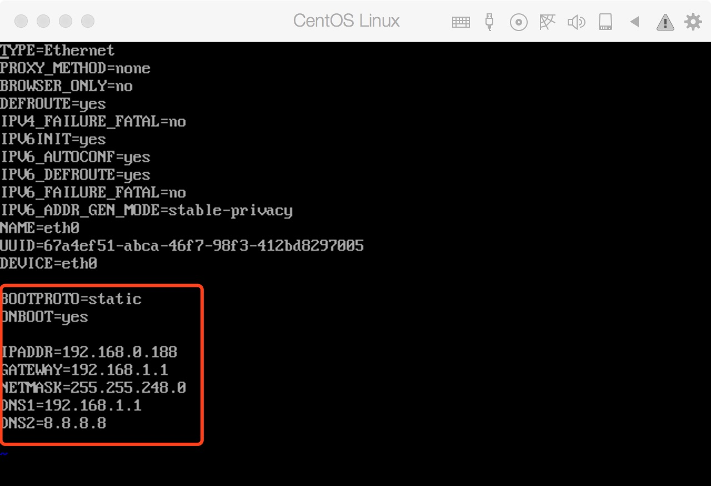

# linux
parallels 安装[centos](http://mirrors.163.com/centos/7.4.1708/isos/x86_64/) 
以上步骤不在阐述

安装后默认是没有网络的，进入 vi /etc/sysconfig/network-scripts/ifcfg-eth0（可能需要管理员权限），修改一下文件



修改后的值

```ONBOOT=yes
BOOTPROTO=static
```

添加的新值

```IPADDR=192.168.0.188
GATEWAY=192.168.1.1
NETMASK=255.255.248.0
DNS1=192.168.1.1
DNS2=8.8.8.8

```
保存后网络重启

```[root@localhost ~]# /etc/init.d/network stop
[root@localhost ~]# /etc/init.d/network start
```

    

